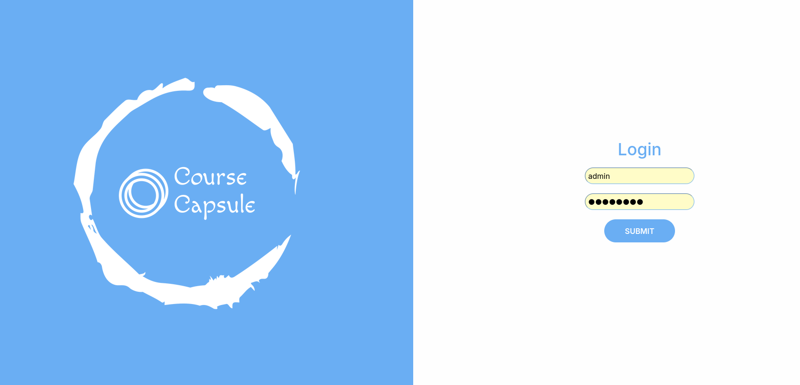
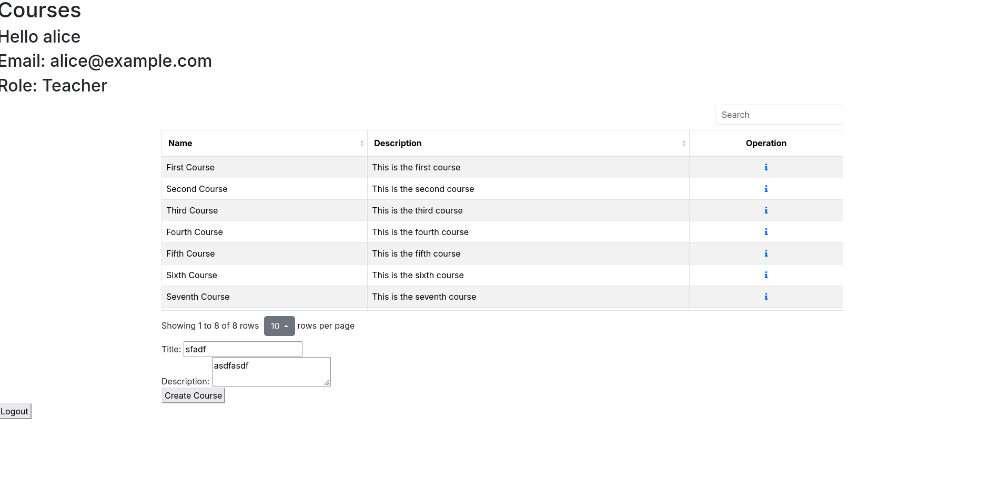
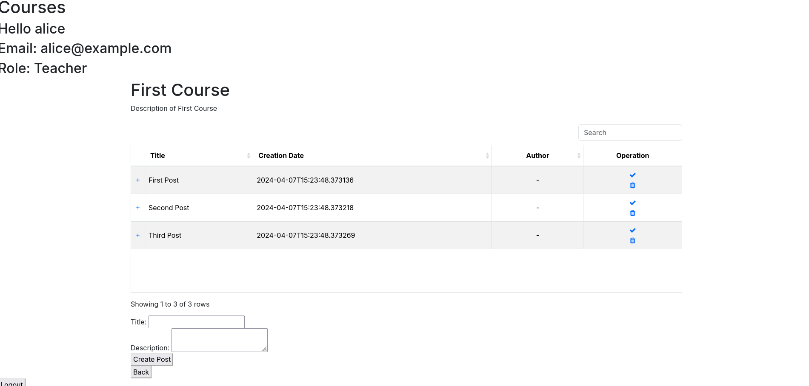

# Course Capsule TODO.md

## Use of the Product

To setup and run this web application, follow the setup instructions in README.md, then follow "Running the Server" and "Running the Client", also in README.md. After following these instructions, you should have two terminal windows running, one with the FastAPI backend running and the other with the frontend web server running, and you should be able to access the frontend by typing `localhost:5000` in your web browser. You should see the login page, which is shown below.



Several users are created automatically for the purposes of demonstration. Login using their accounts with the following credentials:

- student user
    - username: `bob`
    - password: `1234`
- teacher user
    - username: `alice`
    - password: `1234`
- admin user
    - username: `admin`
    - password: `password`

Upon logging in, three default courses should be visible. This is shown in the screenshot below.



This screen allows for courses to be created. And if the user is an administrator, they can delete courses. Enter into a course by clicking the view button. Upon viewing a course, the following post list page should be shown.



In the post list page, posts can be viewed and created. And if the user is a teacher or administrator, they will be able to approve of a post. Once a post is approved, it will be visibly different for all users.

## Known Issues

As of the time of writing, these are the known issues with the product. A check mark will be placed beside an issue if it has been resolved.

- [ ] In the frontend, posts can be approved multiple times (causing integrity error in database), and cannot be unapproved.
- [ ] In the frontend, posts cannot be deleted.
- [ ] The frontend code in `index.html` is in dire need of refactoring.

## Troubleshooting

### 1. `sqlalchemy.exc.OperationalError`

The most common error will be something like the following, which might appear in the FastAPI application after running uvicorn in the terminal:
```
sqlalchemy.exc.OperationalError: (sqlite3.OperationalError) no such table: user
[SQL: SELECT user.id, user.email, user.username, user.password, user.role 
FROM user]
(Background on this error at: https://sqlalche.me/e/20/e3q8)
```

If this occurs, then your database is likely not initialized. Ensure all changes are up-to-date by running `git pull`, then run `alembic upgrade head` to initialize all database migrations.

If the above steps don't work or produce errors, try deleting the `db.sqlite3` file and re-run `alembic upgrade head`.
